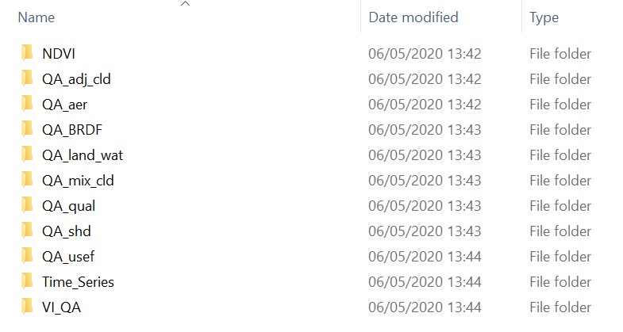

# Pre-processing MODIS NDVI and deriving monthly composites
  
Paulo N Bernardino (paulo.nbernardino@gmail.com)

[Division Forest, Nature and Landscape, KU Leuven](https://ees.kuleuven.be/fnl/staff/index.html?intranet=u0115271)

[Laboratory of Geo-information Science and Remote Sensing, Wageningen UR](https://www.wur.nl/en/Persons/Paulo-P-Paulo-Negri-Bernardino-MSc.htm)


## Getting started

Set your working directory to the source file location. 


Next, the code below will install/load the required packages. 

```{r, echo=TRUE, message=FALSE, eval=TRUE}
# pkgTest is a helper function to load packages and install packages only when they are not installed yet.
pkgTest <- function(x)
{
  if (x %in% rownames(installed.packages()) == FALSE) {
    install.packages(x, dependencies= TRUE)
  }
  library(x, character.only = TRUE)
}
neededPackages <- c("raster", "rgdal", "gimms")
for (package in neededPackages){pkgTest(package)}
```


When you download MODIS data using the MODIStsp R package, the folders structure should look like the image below: 


{width=685px, height=319px}

If that's the case, you can use the code below to load the files into R.

```{r, echo=TRUE, message=FALSE}
## Create list objects containing the path to your files
files_ndvi <- list.files("data/NDVI", full.names = TRUE, pattern=".tif")
files_qa <- list.files("data/QA_qual", full.names = TRUE, pattern = ".tif")
files_qa_use <- list.files("data/QA_usef", full.names = TRUE, pattern = ".tif")
files_qa_lw <- list.files("data/QA_land_wat", full.names = TRUE, pattern = ".tif")
files_qa_mix <- list.files("data/QA_mix_cld", full.names = TRUE, pattern = ".tif")
files_qa_aer <- list.files("data/QA_aer", full.names = TRUE, pattern = ".tif")
files_qa_shd <- list.files("data/QA_shd", full.names = TRUE, pattern = ".tif")
files_qa_brdf <- list.files("data/QA_BRDF", full.names = TRUE, pattern = ".tif")

## Use the files lists to load the data as raster stacks
ndvi <- stack(files_ndvi)
qa <- stack(files_qa)
qa_use <- stack(files_qa_use)
qa_lw<-stack(files_qa_lw)
qa_mix<-stack(files_qa_mix)  
qa_aer<-stack(files_qa_aer)  
qa_shd<-stack(files_qa_shd)  
qa_brdf<-stack(files_qa_brdf)
```

Tha table below summarizes the meaning of the values inside each layer.

{width=382, height=436px}

## Cropping to the study area

The data used here is already restricted to a study area, but if the data that you downloaded comprises a larger extent than the one you'll use in your analysis, you can use the code below (adjusting the extent accordingly) to crop all layers to the right extent.

```{r, echo=TRUE, message=FALSE}
## Cropping to study area
ext<-extent(-15.1,-15,13.65,13.8) # set the desired extent
crop_studyA<-function(x){out<-crop(x,ext)
  return(out)}

ndvi_site<-crop_studyA(ndvi)
qa_site<-crop_studyA(qa)
qa_use_site<-crop_studyA(qa_use)
qa_lw_site<-crop_studyA(qa_lw)
qa_mix_site<-crop_studyA(qa_mix)
qa_aer_site<-crop_studyA(qa_aer)
qa_shd_site<-crop_studyA(qa_shd)
qa_brdf_site<-crop_studyA(qa_brdf)
```

## Masking bad quality data

Here, we'll use only the QA flags specified in the table previously presented. But if e.g. your study area has snow and you want to get rid of it, you can also use the Snow/ice QA layer.

```{r, echo=TRUE, message=FALSE}
## Masking, leaving only good (0) and marginal (1) data
qa_mask <- qa_site==0 | qa_site==1
ndvi_masked<-mask(ndvi_site, qa_mask, maskvalue=0)

## Masking not useful (>13) data 
qa_mask2<-qa_use_site<13
ndvi_masked<-mask(ndvi_masked, qa_mask2, maskvalue=0)

## Masking water (!=1)
qa_mask3<-qa_lw_site==1
ndvi_masked<-mask(ndvi_masked, qa_mask3, maskvalue=0)

## Masking mixed clouds (1)
qa_mask4<-qa_mix_site==0
ndvi_masked<-mask(ndvi_masked, qa_mask4, maskvalue=0)

## Masking high (3) aerosol 
qa_mask5<-qa_aer_site<3
ndvi_masked<-mask(ndvi_masked, qa_mask5, maskvalue=0)

## Masking shadows (1)
qa_mask6<-qa_shd_site==0
ndvi_masked<-mask(ndvi_masked, qa_mask6, maskvalue=0)

## Masking not corrected for BRDF (1)
qa_mask7<-qa_brdf_site==0
ndvi_masked<-mask(ndvi_masked, qa_mask7, maskvalue=0)

## Visualizing results
par(mfrow = c(1,2), mar = c(3,3,5,5))
plot(ndvi_site[[28]], main="Before masking")
plot(ndvi_masked[[28]], main="After masking")
```

## Creating the monthly composites

Our data right now is on a bi-monthly temporal resolution, starting in the second half of February 2000, and ending in December 2010. We have an image every ~16 days, 23 images every year, so in total we have 250 images (layers).  We'll make monthly composites, using the max per-pixel value for each month.

```{r, echo=TRUE, message=FALSE}
## Creating monthly indices (equal numbers for each month)
mi_2000 <- c(1, rep(2:8, each=2), 9, 10, 10, 11, 11) 
# monthly index for 2000 is different than the rest,
# as we have only 1 image in February
mi_year <- c(rep(1:8, each=2), 9, rep(10:12, each=2)) 
mi <- c()
for (i in 1:10){
  mi <- c(mi, mi_year + (12*i))
}
mi <- c(mi_2000, mi)

length(mi) == nlayers(ndvi_masked) # should be the same, i.e., one index per image

## Deriving the monthly composites
ndvi_monthly <- monthlyComposite(ndvi_masked, mi, fun = max)
```


Visulalizing some of the maps before and after compositing.


```{r, echo=TRUE, message=FALSE}
par(mfrow=c(2,3), mar = c(2,3,3,5))

plot(ndvi_masked[[8]], main="June (1) 2000 (before)")
plot(ndvi_masked[[9]], main="June (2) 2000 (before)")
plot(ndvi_monthly[[5]], main="June 2000 (after)")

plot(ndvi_masked[[54]], main="June (1) 2002 (before)")
plot(ndvi_masked[[55]], main="June (2) 2002 (before)")
plot(ndvi_monthly[[29]], main="June 2002 (after)")
```


Visulalizing some time series before and after compositing. Dotted vertical red lines represent time-steps with NA values.


```{r, echo=TRUE, message=FALSE}
ts_bef <- ts(as.numeric(ndvi_masked[670]), start = c(2000, 02), frequency = 23)
ts_after <- ts(as.numeric(ndvi_monthly[670]), start = c(2000, 02), frequency = 12)

par(mfrow=c(2,1))

plot(ts_bef, bty = "n", ylab = "NDVI", lwd = 3)
NA_bef <- time(ts_bef)[is.na(ts_bef)]
abline(v = NA_bef, col = "red", lty = 3)

plot(ts_after, bty = "n", ylab = "NDVI", lwd = 3)
NA_after <- time(ts_after)[is.na(ts_after)]
abline(v = NA_after, col = "red", lty = 3)
```